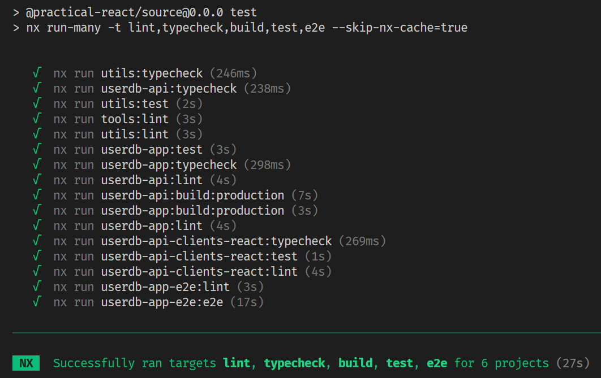
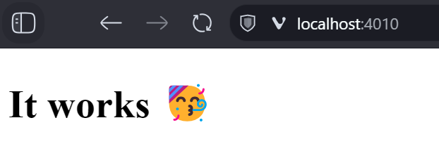
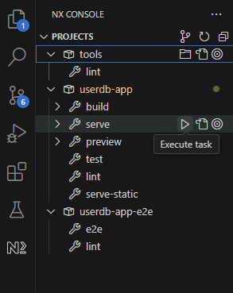
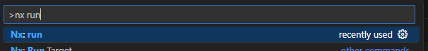
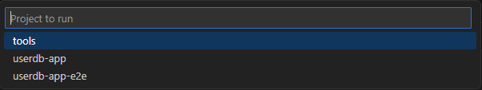
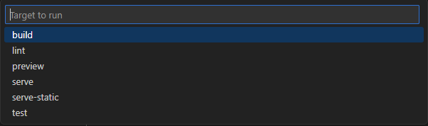
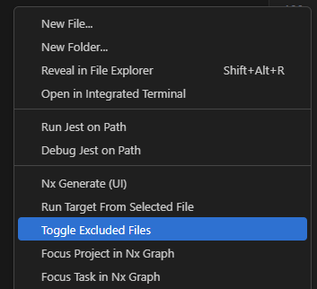

<h1>Practical React with TypeScript</h1>

👋 Welcome to the repository for the workshop [Practical React with TypeScript](https://www.bouvet.no/kurs/kategorier/utvikling-for-web-og-mobil/workshop-praktisk-react-med-typescript)!

> [!NOTE]
> Having trouble installing prerequisites? Got questions during or after the course that weren't answered fully? Feel free to open a thread in the [Discussion section](https://github.com/rudfoss/practical-react-with-typescript/discussions/categories/q-a)

- [Prerequisites](#prerequisites)
- [Setting up your development environment](#setting-up-your-development-environment)
- [Running the applications](#running-the-applications)
- [Regenerate api clients](#regenerate-api-clients)
- [VSCode](#vscode)
  - [VSCode Extensions](#vscode-extensions)
  - [Hidden files](#hidden-files)

> [!TIP]
> A branch will be created for the specific course named `courses/[date]`. The date is the month the course started in e.g.: `courses/202412`. After the course you can go back to that branch and see each commit that was performed as well as find the full slide deck.

## Prerequisites

> [!IMPORTANT]
> Please install and verify all prerequisites before the first day of the course.

In this course we will be working with an [integrated Nx](https://nx.dev/)-managed [monorepo](https://monorepo.tools/). This setup requires a few things to be installed on your machine in order to work. The code and project will work fine on Windows, Linux or Mac, but please install the following before you proceed with [setting up your environment](#setting-up-your-environment). You should be able to verify that the installation succeeded by running the verify command from a terminal.

| What                                                         | Why                                                                    | Verify                             |
| ------------------------------------------------------------ | ---------------------------------------------------------------------- | ---------------------------------- |
| [Git](https://git-scm.com/downloads)                         | Version Control for the source code                                    | `git --version`                    |
| [NodeJs LTS](https://nodejs.org/en/download/package-manager) | Runtime for dev environment, api, Nx (monorepo) and front-end projects | `node --version` / `npm --version` |

> [!NOTE]
> The course will be using [Visual Studio Code](https://code.visualstudio.com) with [several extensions](#vscode) and customized settings that will be demonstrated when used. You are free to choose any IDE you want, but it is highly recommended that you pick one which [integrates well with Nx](https://nx.dev/core-features/integrate-with-editors). Plugins for the IDE are not strictly required, but it makes working with the project and with nx commands much easier.

## Setting up your development environment

Once you have installed all prerequisites you can clone the repository to your machine using git:

```bash
# Clones the repository into the folder 'practical-react' (feel free to change the name if you want)
git clone https://github.com/rudfoss/practical-react-with-typescript.git practical-react
```

This will clone the main branch to your machine. Open a terminal in the root folder of the workspace and execute the setup command.

```bash
npm run setup
```

If the command fails you might not have installed all the [required prerequisites](#prerequisites) or you may need to restart your terminal for your paths-environment to take effect. Once setup is completed you are ready to run the applications in the workspace.

Once setup is complete you should also be able to run the full suite of tests without failures. From a terminal in the root workspace folder run:

```bash
# equivalent to "npm run test"
npm test
```

You should see something similar to this:



If the tests fail verify that you have all the required prerequisites installed correctly.

## Running the applications

The React application is bundled using Vite and started using the Nx task runner. Vite provides a live development environment that reloads modules when they are changed. To run the environment using Nx you can "run the target" `serve` for the project `userdb-app` like this:

```bash
npx nx run userdb-app:serve
# or
npm run start:app
```

During the course we will also be working with an API application in order to learn how to talk to a remote server. You can start this API by running the target `serve` for the `userdb-api` project:

```bash
npx nx run userdb-api:serve
# or
npm run start:api
```

To simplify this the [`package.json`](./package.json) file contains a short cut for running both the App and the API together:

```bash
# equivalent to "npm run start"
npm start
```

You should be able to open your browser to [http://localhost:4010](http://localhost:4010) and see this:



There are many ways to run these targets:

1. You can use the terminal directly by typing `npx nx run [project]:[target]`
2. You can use the VSCode extension:

   

3. You can use the command palette: `F1` -> `Nx run`

   
   
   

## Regenerate api clients

> [!NOTE]
> This part is **NOT** required for the course since generated code is already committed to the repository, but instructions are kept for those who'd like to try it out.

This repository is set up to use NSwag to generate clients directly from the API definition (OpenAPI/Swagger definition). To run the generator start the `codegen` targets for all relevant projects.

```bash
npx nx run-many -t codegen
```

NSwag is a tool written in .NET and therefore it requires the .NET runtime to work. Instructions for installing it can be found [here](https://dotnet.microsoft.com/en-us/download).

## VSCode

This repository has a few things pre-configured for [VSCode](https://code.visualstudio.com) which is why it is highly recommended. To avoid collision between different projects you might want to create a new [Profile](https://code.visualstudio.com/docs/editor/profiles) for the course before you begin.

The first time you open this repository in VSCode you should be prompted to install all recommended extensions. If you missed the prompt you can open the `Extensions` panel and enter the search text `@recommended`. There's a button next to the "recommended" section that will install all of them at once.

### VSCode Extensions

Below is a list of all recommended extensions and what they do:

| Extension                                                                                     | Description                                                                               |
| --------------------------------------------------------------------------------------------- | ----------------------------------------------------------------------------------------- |
| [Auto Comment Blocks](vscode:extension/kevinkyang.auto-comment-blocks)                        | Helps when documenting your JS/TS code.                                                   |
| [Code Spell Checker](vscode:extension/streetsidesoftware.code-spell-checker)                  | Spell checker for code and documentation.                                                 |
| [EditorConfig for VS Code](vscode:extension/editorconfig.editorconfig)                        | ESupport for some [EditorConfig](https://editorconfig.org/) settings in VSCode.           |
| [ESLint](vscode:extension/dbaeumer.vscode-eslint)                                             | Highlight issues and problems with your code in the editor and can fix many of them.      |
| [Jest Runner](vscode:extension/firsttris.vscode-jest-runner)                                  | Run Jest tests from a separate panel.                                                     |
| [Markdown All in One](vscode:extension/yzhang.markdown-all-in-one)                            | Tools for writing and working with markdown files.                                        |
| [NX Console](vscode:extension/nrwl.angular-console)                                           | Several utilities for working with [NX monorepos](https://nx.dev/getting-started/why-nx). |
| [Peek Hidden Files](vscode:extension/adrianwilczynski.toggle-hidden)                          | Toggles hidden files.                                                                     |
| [Playwright Test for VSCode](vscode:extension/ms-playwright.playwright)                       | Run and debug playwright tests from a separate panel.                                     |
| [Prettier - Code formatter](vscode:extension/esbenp.prettier-vscode)                          | Automatically format code on save.                                                        |
| [TypeScript Barrel Generator](vscode:extension/eliostruyf.vscode-typescript-exportallmodules) | Helps with exporting multiple files in a folder using and `index.ts` barrel-file.         |
| [vscode-icons](vscode:extension/vscode-icons-team.vscode-icons)                               | Icon-pack for the explorer with many additional icons.                                    |
| [vscode-styled-components](vscode:extension/styled-components.vscode-styled-components)       | Syntax highlighting and IntelliSense for styled-components.                               |

### Hidden files

If you are using VSCode you might notice that there are quite a few files in the repository that are not visible inside the editor. This is because there is a setting in this repository that hides rarely used files.

Inside the `.vscode` folder you'll find [`settings.json`](./.vscode/settings.json). This is the file that configures VSCode for the current workspace (folder). In there is a setting called `files.exclude` which contains several file patterns that should be hidden from the file explorer. If you installed the `Peek Hidden Files` extension (recommended) you can toggle these files by right-clicking in the explorer panel and selecting "Toggle Excluded Files" or by using the command palette `F1` -> `Toggle Excluded Files`.


